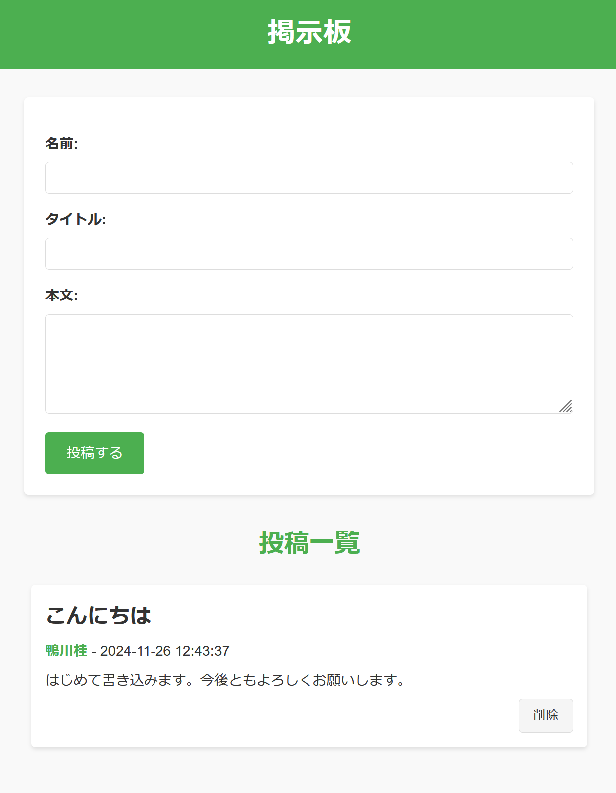

# 概要

入門者向けのPHP掲示板のサンプルです。改変、配布などはご自由に。

# 機能

投稿と削除ができます。



# 技術

PHP入門でよく見かけるHTMLとコードの混じった記法が、
かえって判りにくく感じている人向け。

- フレームワークなし
- クラスを用いたMVC
- 共用サーバへアップロードする前提の構成

Laravelへステップアップする準備になるよう、
テンプレートエンジンはBladeを用いています。

# 実行までの想定手順

## 開発用サーバで掲示板を開くまでの10ステップ

Windows 11を使用。

1. XAMPPをインストール
2. Windowsの環境変数PATHに `C:\xampp\php`追加。
3. Composerをインストール
  - https://getcomposer.org/download/
  - Composer-Setup.exe をダウンロード、インストール
4. phpMyAdminを開く 
  - XAMPPでMySQLとApacheをStart
  - http://localhost/phpmyadmin/
  - board という名前のデータベースを作成
  - 下のMySQLのテーブル定義どおりのテーブルを作成

```
CREATE TABLE messages (
    id INT AUTO_INCREMENT PRIMARY KEY,
    name VARCHAR(100) NOT NULL,
    title VARCHAR(255) NOT NULL,
    content TEXT NOT NULL,
    created_at TIMESTAMP DEFAULT CURRENT_TIMESTAMP
) CHARACTER SET utf8mb4 COLLATE utf8mb4_unicode_ci;
```

5. このリポジトリをFork
  - php-board-sampleフォルダが作成されます。
6. このリポジトリをclone
  - VSCodeをインストールして、クローンしたphp-board-sampleフォルダを開く
7. config.php.templateを修正
  - ローカル環境向けのデータベース接続設定に、上記XAMPPで設定したMySQLのデータベース名などを記入。

  - 記入後、ファイル名をconfig.phpに変更した後、configディレクトリの下へ置く。

  記入例 ）
  ```
  if ($environment === 'local') {
  return [
    'DB_HOST' => 'localhost',
    'DB_NAME' => 'board',
    'DB_PORT' => '3306',
    'DB_USER' => 'root',
    'DB_PASS' => '',
  ];
}
  ```
8. パッケージのインストール
  - VSCodeでターミナルを開いて次のコマンドを実行
  - composer install
9. PHPのビルトインサーバ実行
  - 同じく次のコマンドを実行
  - php -S localhost:8080
10. ブラウザでページを開く
  - http://localhost:8080/board/


## デプロイ

- InifinityFree でアカウント作成
- MySQL Databaseを開いて、データベースとテーブル作成
- データベースの接続情報を config/config.php へ追記。

記入例）
```
if ($environment === 'local') {
  return [
    'DB_HOST' => 'localhost',
    'DB_NAME' => 'board',
    'DB_PORT' => '3306',
    'DB_USER' => 'root',
    'DB_PASS' => '',
  ];
} else {
  return [
    'DB_HOST' => 'sqlXXX.infinityfree.com',
    'DB_NAME' => 'if0_XXXXXXXXXX_board',
    'DB_PORT' => '3306',
    'DB_USER' => 'if0_XXXXXXXXXX',
    'DB_PASS' => 'XXXXXXXXXXX',
  ];
}
```

- FFFTPをインストール
- FFFTPでInfinityFreeへ接続
- htdocs以下にある初期データはすべて削除
- htdocs直下に下記ファイルとフォルダをアップロード
  - .htaccess
  - board/
  - config/
  - src/
  - vendor/
- htdocs直下にcacheフォルダを作成
- 割り当てられたホスト名に /board/ を加えたURLを開く
  - 例）http://xxx.lovestoblog.com/board/

## 今後の発展

アプリが大きくなった場合には、次のことを検討してください。

- 名前空間の利用
- Composerを用いた自動ローディング

さらに次へステップアップする場合、Laravelフレームワークの利用を検討してください。

## License

These codes are licensed under CC0.
[](http://creativecommons.org/publicdomain/zero/1.0/deed.ja)
